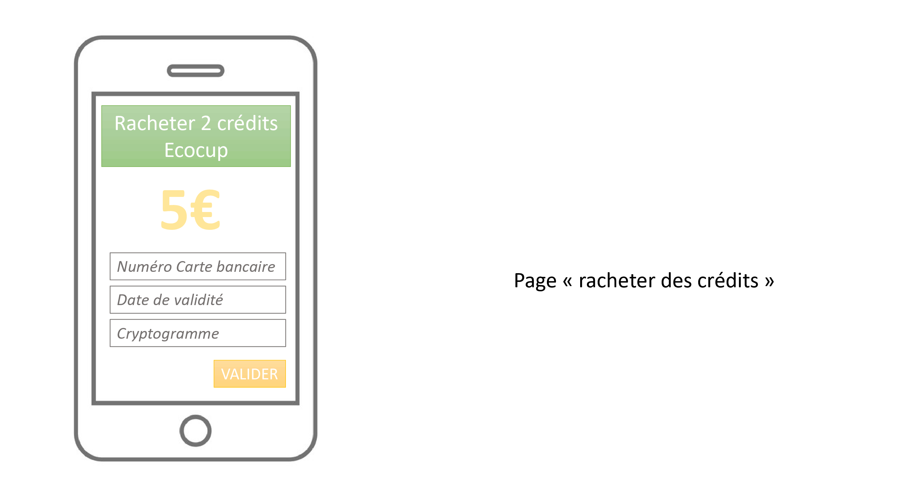

=== Interface utilisateur graphique

On intégrera sur la machine une tablette tactile pour une interraction entre les utilisateurs/administrateurs et la machine.

_Interface utilisateur/distributeur_
Objectifs de l'interface : 

* Affichage d’un message d’erreur s'il n'y a pas de cups dans la machine, s'il y a trop de cups dans le stockage des dépôts ou si la machine ne fonctionne pas
* Choix retrait/depot du verre
* Choix d'identification par QR code ou par ID et code secret
* Indique quand afficher le QR Code
* Connexion par entrée de l'identifiant et du mot de passe
* Affichage d'un message d'erreur si l'utilisateur n'a plus de crédit
* Souhaiter une bonne soirée à l'utilisateur

image::../images/i_d_15.jpg[dis14]

_Interface administrateur/distributeur_
Objectifs de l'interface :

* Choix d'identification au compte administrateur de l'école par QR code ou par identifiants et mot de passe
* Connexion par entrée de l'identifiant et du mot de passe
* Affichage des statistiques : nombre d'Ecocups disponibles, nombre d'Ecocups dans la "poubelle", capacité maximale
* Mise à jour manuelle du nombre d'Ecocups disponibles après ajout/ retrait des Ecocups dans la machine

_Interface utilisateur/application_

* Page d’accueil : option de generer un QR-code, racheter des credits ou se connecter a son profil
* Page Générer un QR-code 
* Page Racheter 2 credits Ecocups (options d’entree ses codes bancaires)
* Page Connexion via ses identifiants Telecom

Prise en main du module Mise en oeuvre d'une interface web:

Installation de Tomcat:

* affichage de la date et de l’heure