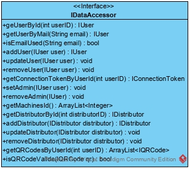
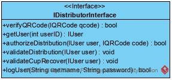
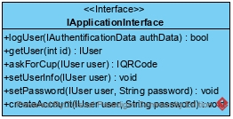
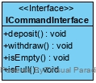

=== Description des interfaces

===== Serveur distant

====== Interface base de données

Cette interface permet la communication entre les différents modules présents sur le serveur et la base de donnée. 

Les différentes fonctions implémentées correspondent aux différentes requêtes INSERT, SELECT, UPDATE et DELETE qui seront réalisées sur la base de donnée.

[[ISrvDistP]]
====== Zone distributeur - Requêtes

Cette interface permet de transmettre les requêtes des distributeurs reçues via le module communication client-serveur au reste du serveur.

•	verifyQRCode permet de vérifier si le QRCode passé en argument est bien associé à l'utilisateur courant et valide.
•	authorizeDistribution permet de demander au serveur si la machine est autorisée à délivrer l'écocup.
•	validateDistribution permet d'enregistrer la distribution auprès du serveur.
•	validateCupRecover permet d'enregistrer la récupération d'une écocup auprès du serveur.

[[ISrvAppP]]
====== Zone application - Requêtes

Cette interface permet de transmettre les requêtes de l'application reçues via le module communication client-serveur au reste du serveur.

•	logUser doit permettre à un utilisteur de se connecter.
•	askForCup doit permettre la demande d'un QRCode pour récupérer une écocup.

===== Application

====== Requêtes

Cette interface permet de faire transmettre les requêtes de l'application reçues via le module communication client-serveur au reste du serveur.

Cf <<ISrvAppP, IDistributorInterface>>

===== Distributeur

====== Requêtes

Cette interface doit permettre au distributeur d'effectuer des requêtes au serveur.

Cf <<ISrvDistP, IDistributorInterface>>

====== Ordre

Cette interface doit permettre de faire communiquer l'interface utilisateur graphique et les parties mécaniques de la machine afin de lui transmettre les ordres nécéssaires à la distribution et à la collecte des écocups.

•	deposit doit lancer la procédure de dépôt d'une écocup.
•	withdraw doit lancer la procédure pour que l'utilisteur récupère une écocup.
•	isEmpty permet de savoir si la machine est vide.
•	isFull permet de savoir si la machine est pleine.
