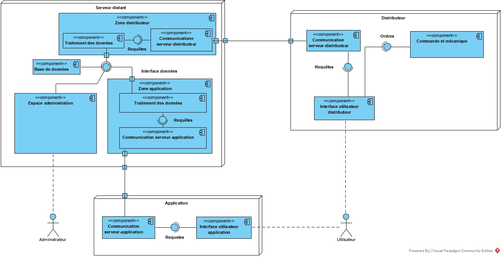

=== Schéma d’architecture

==== Description des blocs

===== Serveur distant

====== Base de données
L'objectif est de stocker sur un serveur commun les comptes étudiants de toutes les écoles du plateau de Saclay. La table des comptes a pour attributs:

* identifiant (clé primaire)
* mot de passe
* status : administrateur ou utilisateur
* nom
* prénom
* école
* nombre de crédits disponibles

image::../images/Schéma_bdd_new.jpg[Schéma bloc bdd]

====== Zone distributeur - Traitement des données 

Ce bloc doit traiter les requêtes faites par le distributeur, telle que les demandes de vérification de QR code ou les ajouts ou retraits de crédits liés à la distribution et à la récupération des ecocups.

====== Zone distributeur - Communication serveur-distributeur

Ce bloc doit permettre de recevoir les différentes requêtes faites par la machine et de transmettre ces requettes à la base de donnée ou au bloc de traitement. Il doit aussi concaténer les informations reçus de la base de donnée et du bloc de traitement et les renvoyer à la machine.

====== Zone application - Traitement des données

Un QR code sera généré est attribué à l’identifiant créé via l’application.
Le traitement des données de l’utilisateur consiste également à savoir si un utilisateur possède des crédits.

====== Zone application - Communication serveur-application

Ce bloc doit permettre de recevoir les différentes requêtes faites par l'application et de transmettre ces requettes à la base de donnée ou au bloc de traitement. Il doit aussi concaténer les informations reçus de la base de donnée et du bloc de traitement et les renvoyer à l'application.

===== Application

====== Communication serveur-application

Différentes communications entre l'application et le serveur sont nécessaires :

* la requête d'ajout de crédit
* l'application est en mesure de récupérer le nombre de crédit sur un compte auquel elle s'est préalablement connecté.
* l'application a accès au QR code généré par le serveur.

====== Interface utilisateur application

L'application permet à l'utilisateur d'accéder à son compte. Il pourra alors consulter le nombre de crédits qu'il possède, recharger son compte si besoin (en cas de perte d'écocup), il pourra de plus afficher un QR code lié à son compte, qui lui permettra d'interagir directement avec le distributeur afin de retirer ou déposer une écocup.

===== Distributeur

====== Communication serveur distributeur

Ce bloc doit permettre d'envoyer les différentes requêtes faites par la machine au serveur et de recevoir les réponses de celui-ci.

====== Interface utilisateur distributeur

L'utilisateur se présente face à la machine, il va communiquer avec cette dernière via un écran tactile. 
Ce dernier présentera les fonctions suivantes :

* Indiquer à l'utilisateur s'il est possible de faire un retrait de cup.
* L'utilisateur choisit s'il fait un retrait ou un dépôt.
* l'écran affichera la direction pour deposer ou retirer une cup si les crédits le permettent.
* l'utilisateur choisit s'il s'identifie avce son QR code ou avec son ID et son code secret.
* l'écran indiquera également si la machine est défectueuse

====== Interface administration distributeur

L’interface doit permettre à l’administrateur de gérer la machine et de visualiser son bon fonctionnement. Il faut les fonctions suivantes :

•	Afficher un message d’erreur s’il y a un disfonctionnement
•	Mettre la machine en maintenance
•	Avoir accès à la quantité de cups entrée, sortie et restante dans chaque compartiment 

====== Commande et mécanique

Le distributeur doit être en mesure de récupérer un écocup restitué par un utilisateur et de le stocker dans l'attente qu'un administrateur s'en occupe. Il peut aussi accéder à son stock d'écocups, en prendre un et le donner à l'utilisateur sans que celui-ci n'aiit accès aux autres écocups. De plus, lorsqu'il n'y a plus d'écocup disponible ou que le distributeur n'a plus de place pour récupérer des écocups, la machine le détecte pour ensuite en faire part à l'administrateur.