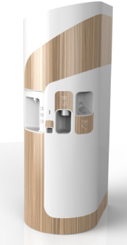
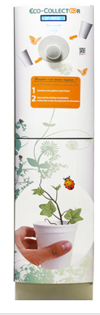

=== Description de l’état de l’art

La machine Re(co)cup ressemble à un distributeur automatique de boissons à la différence près qu’il est connecté.
La technologie *M2Key™* développée par la société CLOUD CONNECTE <<M2Key,[1]>> offre une interaction sécurisée multimodale entre un équipement connecté et un smartphone. Une des applications proposées par l’entreprise est un distributeur connecté qui permet une transaction entre un utilisateur, qui contrôle l’opération de son téléphone, et le distributeur automatique qui délivre un service. Le distributeur automatique, connecté à internet, va afficher un QR code sur un écran graphique. Ce système repose sur le même principe d’utilisation du QR code pour l’identification mais son utilisation serait inversée sur la machine Re(co)cup : le smartphone affiche le QR code alors que la machine dispose d’un lecteur de QR code.

*CleanCup®* est un distributeur de gobelets recyclables qui fonctionne sur le principe de consigne <<CleanCup,[2]>> : on introduit une somme d’argent en retirant un gobelet, qui nous est rendue lorsque l’on réintroduit le gobelet dans la machine. La machine Re(co)cup repose en revanche sur la dématérialisation de la monnaie puisqu’elle utilise uniquement l’application sur laquelle on aura des crédits.De plus, CleanCup® sert des boissons, ce qui n’est pas le cas de Re(co)cup qui fournit uniquement le gobelet.

*Ecocollector* est une machine permettant la collecte des gobelets plastiques ou cartons <<Ecocollectoor,[3]>>, et non d’ecocups, afin de les recycler. Elle utilise un système de reconnaissance de gobelets grâce à l’infrarouge. Cette machine représente une partie de notre machine Re(co)cup, qui quant à elle, au lieu d’utiliser l’infrarouge, utiliserait un moule pour la reconnaissance des ecocups.

