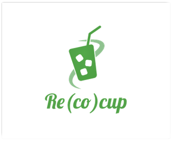
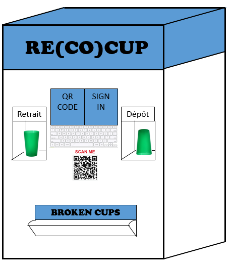

=== Description de la proposition
*_La machine Recocup._*

Les étudiants des écoles supérieures sont globalement concernés par la problématique écologique. L'utilisation de gobelets en plastiques jetables est donc inappropriée. Les écocups (des verres en plastique plus rigide réutilisables) représentent une alternative viable. Néanmoins les événements de vie étudiante distribuent souvent de nouvelles écocups, qui vont s'entasser avec les anciennes. De plus, il faut que chaque étudiant pense à rapporter une écocup lorsqu'il veut être servi. Pour pallier ces problèmes, nous proposons d'installer des machines Recocup dans les débits de boisson étudiants. 

Après avoir décidé de réaliser ce projet, nous avons établi la nécessité respective des différents modules. Nous pensons que la machine, outre l'aspect mécanique de son fonctionnement, doit être capable de reconnaître le QR code présenté par l'utilisateur sur son téléphone afin de l'identifier dans la base de données, pour connaître son nombre de crédits. Ce choix, plutôt que le processus inverse, a été réfléchi pour permettre une reconnaissance même si l'utilisateur n'est pas connecté à Internet avec son téléphone. Le stockage et le nettoyage des écocups au sein de la machine restent pour l'instant purement théoriques, le nettoyage étant même envisagé pour l'instant comme réalisé par le bar de l'École. 
Si la machine avait à être commercialisée, nous envisageons un déploiement sur l'ensemble des écoles du plateau de Saclay, depuis lesquelles il pourrait apparaître des problèmes d'accès à nos bases de données si nous créons nos bases de données sur les serveurs de de Télécom.

La conception de la machine prototype s'est en résumé faite successivement, d'autant plus que nous avons fait face à des incompréhensions concernant notre projet. Notre manque de clarté sur certains points nous a en effet porté préjudice auprès des encadrants du PACT, mais une mise au point passant par une clarification de notre projet suffit à remettre notre projet sur la bonne voie.

* Voici un visuel illustrant le fonctionnement de la machine de façon simpliste :

